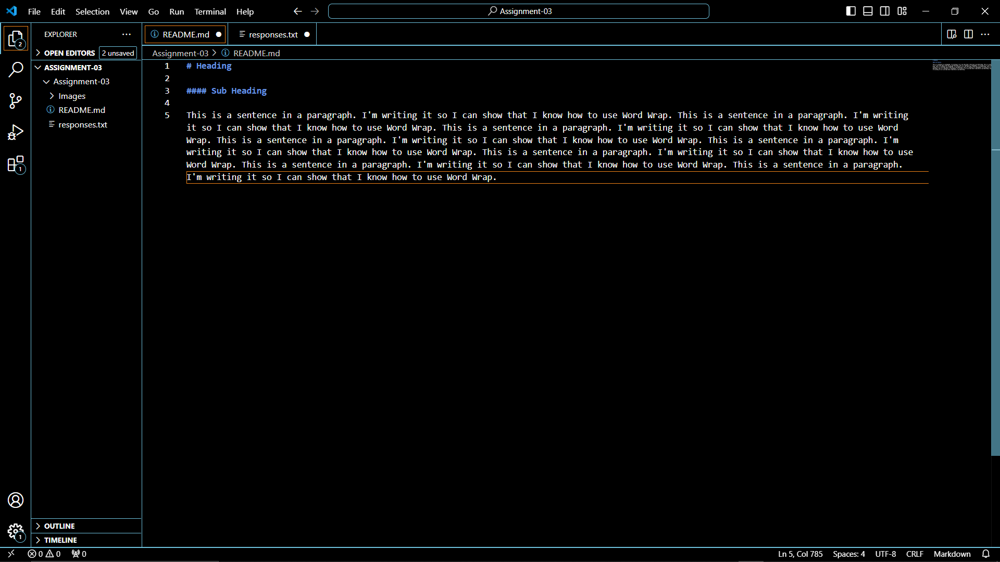

# Heading 

#### Sub Heading 

This is a sentence in a paragraph. I'm writing it so I can show that I know how to use Word Wrap. This is a sentence in a paragraph. I'm writing it so I can show that I know how to use Word Wrap. This is a sentence in a paragraph. I'm writing it so I can show that I know how to use Word Wrap. This is a sentence in a paragraph. I'm writing it so I can show that I know how to use Word Wrap. This is a sentence in a paragraph. I'm writing it so I can show that I know how to use Word Wrap. This is a sentence in a paragraph. I'm writing it so I can show that I know how to use Word Wrap. This is a sentence in a paragraph. I'm writing it so I can show that I know how to use Word Wrap. This is a sentence in a paragraph. I'm writing it so I can show that I know how to use Word Wrap. 

[Cool Website](https://www.coolmathgames.com/)

[My Text File](./responses.txt)

